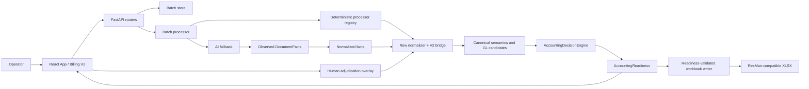
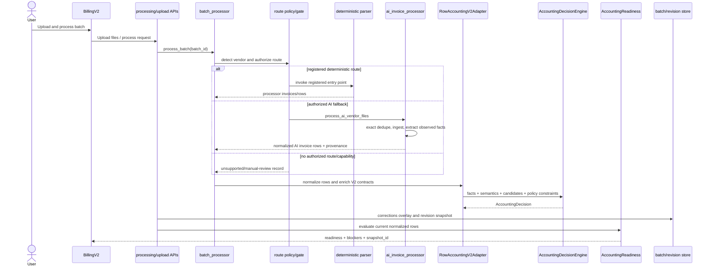
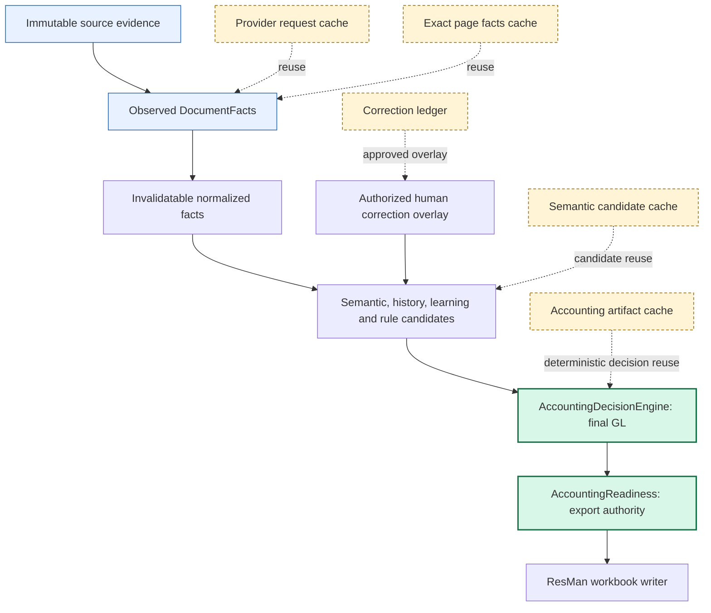
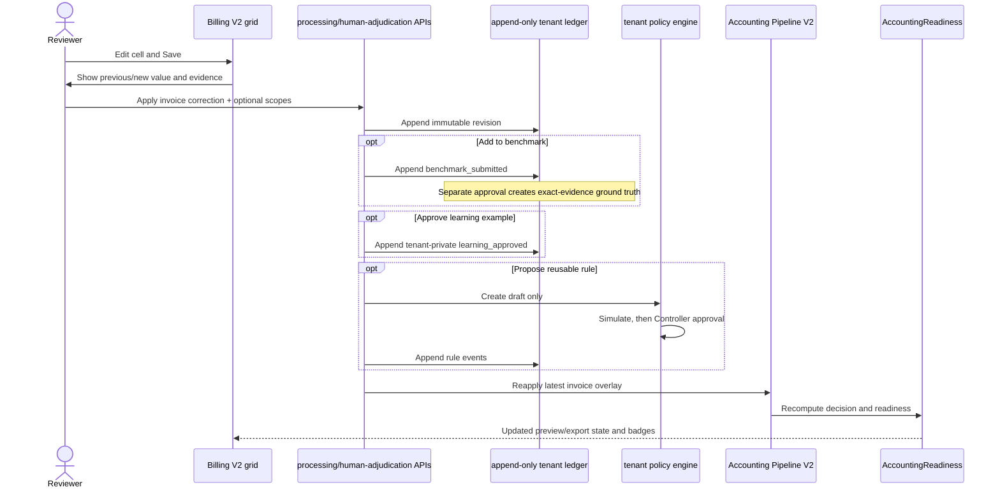

# Innerview Current System Architecture

**Status:** Authoritative description of the implementation on `main` at `da9c0b7` (2026-07-18)

**Audience:** Innerview developers, reviewers, operators, and security owners

**Scope:** Current Billing V2 runtime, compatibility boundaries, accounting authorities, AI routing, caches, human governance, and release gates

This document describes what the repository executes today. It is not a target-state design and does not treat a phase report, model response, cache artifact, or legacy UI as an authority merely because it exists. Claims below were verified through imports, FastAPI router registration, React rendering, runtime call sites, and active tests.

## 1. Executive architecture statement

Innerview is a local-first React and FastAPI application that converts uploaded accounting documents into a ResMan-compatible workbook. A batch may use a registered deterministic parser or a bounded AI fallback. Both routes converge on the same normalized row contract, Accounting Pipeline V2, `AccountingDecisionEngine`, `AccountingReadiness`, Billing V2 preview, human correction overlay, and readiness-gated export.

There are two deliberately separate truth domains:

- **Documentary truth:** immutable source files and observed `DocumentFacts`.
- **Accounting truth:** derived semantics and candidates, the final GL decision made by `AccountingDecisionEngine`, human-approved overlays, and the export decision made by `AccountingReadiness`.

No AI provider is an export authority. No semantic model is a final GL authority. A cached artifact is reusable evidence or derived work, not a substitute for the authority that originally produced it.

## 2. Verified runtime entry points

### 2.1 Frontend

- `webapp/frontend/src/main.tsx` is the browser entry point. It renders `RootRouter`, which chooses a hash-based `PopoutPage` only for a popout hash and otherwise renders `App`.
- `webapp/frontend/src/App.tsx` is the application shell. Its initial module is `billing-v2`, and it renders `BillingV2` from `webapp/frontend/src/features/billing-v2/BillingV2.tsx` when that module is active.
- `BillingV2` owns the active batch selector, upload/process controls, grid, document preview, inline edits, human-adjudication panel, activity popover, readiness refresh, and export control.
- `BillingV2` enables export only when the backend preview says `accounting_readiness.export_allowed === true`; it does not calculate accounting readiness locally.
- The older batch workspace remains mounted or reachable through `App.tsx` for compatibility. It is not the preferred surface for new Billing V2 work.

### 2.2 Backend

- `webapp/backend/main.py` is the backend entry point. `create_app()` constructs FastAPI and module-level `app` is the Uvicorn target.
- The health endpoint is `GET /api/health`.
- Runtime batch files are rooted by `webapp/backend/settings.py` and accessed through `webapp/backend/services/batch_store.py`.

### 2.3 Registered router families

The following routers are imported and registered by `webapp/backend/main.py`; registration, rather than filename presence, makes them part of the current API runtime.

| Router module | Current responsibility |
|---|---|
| `webapp/backend/api/batches.py` | Batch lifecycle and metadata |
| `webapp/backend/api/uploads.py` | Batch file upload |
| `webapp/backend/api/preview.py` | Safe source content and ingestion preview |
| `webapp/backend/api/processing.py` | Detection, processing, preview payload, edits, revisions, activity, and queue router |
| `webapp/backend/api/processing_routes.py` | Per-file/page processing-route policy |
| `webapp/backend/api/export.py` | Readiness evaluation, export creation, and download |
| `webapp/backend/api/regions.py` | Region hints |
| `webapp/backend/api/ai_status.py` | AI configuration/status surface |
| `webapp/backend/api/ai_invoice.py` | AI invoice, test, and batch endpoints |
| `webapp/backend/api/ai_mappings.py` | AI mapping and batch mapping endpoints |
| `webapp/backend/api/vendor_rules.py` | Vendor-rule administration |
| `webapp/backend/api/invoice_format_rules.py` | Output-format rules |
| `webapp/backend/api/canonical_rules.py` | Canonical-rule administration and tests |
| `webapp/backend/api/accounting_assistant.py` | Human-controlled accounting assistant |
| `webapp/backend/api/human_adjudication.py` | Correction history, evidence crops, benchmark, learning, and rule decisions |
| `webapp/backend/api/tenant_accounting.py` | Tenant vendor entities and governed accounting policies |
| `webapp/backend/api/resman_context.py` | Imported ResMan context datasets and snapshots |
| `webapp/backend/api/context_intelligence.py` | Cross-dataset context matrix |
| `webapp/backend/api/deterministic_builder.py` | Governed deterministic-builder sessions |
| `webapp/backend/api/cells.py` | Cell explanation/correction and compatibility learned endpoints |
| `webapp/backend/api/billing_v2.py` | Billing V2 audit and prepare-links bridge |

## 3. System-level component diagram

Principal implementation paths: `webapp/backend/services/batch_processor.py`, `webapp/backend/services/ai_invoice_processor.py`, `webapp/backend/services/row_normalizer.py`, `webapp/backend/services/accounting_integration_bridges.py`, `webapp/backend/services/accounting_decision_engine.py`, `webapp/backend/services/accounting_readiness.py`, and `webapp/backend/services/human_adjudication.py`.

## 4. End-to-end invoice-processing sequence

### 4.1 Stage contract

Every stage below identifies its input, output, authority, mutation boundary, cache, failure behavior, and provenance.

| Stage | Responsibility and principal files | Input → output | Authority and source mutation | Cache dependencies | Failure and audit behavior |
|---|---|---|---|---|---|
| Upload | `webapp/backend/api/uploads.py`; `webapp/backend/services/batch_store.py` | Multipart files → immutable batch input files | Custody boundary only; does not interpret or mutate document content | Batch filesystem identity | Rejects invalid batch/path/file operations; batch metadata and filesystem state identify the upload |
| File/page identity | `webapp/backend/services/document_ingestion.py`; `webapp/backend/services/page_facts_cache.py`; `webapp/backend/services/native_pdf_evidence.py` | Source file/page → type, text/table candidates, exact visual hash, geometry, optional native-PDF evidence | Observational; source is read-only | OCR cache plus exact RGB 144-DPI visual identity and versioned preprocessing | Ingestion warnings remain visible; exact identity is required for fact reuse; approximate similarity cannot reuse facts |
| Duplicate detection | `webapp/backend/services/ai_invoice_processor.py` (`_deduplicate_source_files`, `_deduplicate_invoices`); selected utility processors such as `webapp/backend/services/utility_wave2_processors.py` | File hashes and invoice identity/total evidence → unique work plus duplicate provenance/review | May suppress repeated work, never rewrite source | Exact source hash and derived invoice identity | Exact duplicate sources are recorded; conflicting duplicate totals create manual-review codes. Global `AccountingReadiness.duplicate_status` integration is not yet a single end-to-end authority and defaults to `not_detected` unless supplied |
| Route authorization | `webapp/backend/services/batch_processor.py`; `webapp/backend/services/processing_route_policy.py`; `webapp/backend/services/processing_route_gate.py`; `webapp/backend/api/processing_routes.py` | Detection, registered processor status, page policy, capability → deterministic, AI, or blocked route | Routing authority only; cannot select GL/readiness | Persisted route policy fingerprint and runtime capability/config state | Unknown/unregistered or unauthorized fallback becomes unsupported/manual review; it must not disappear |
| Deterministic extraction | `_PROCESSOR_LOADERS` in `webapp/backend/services/batch_processor.py` and its registered processor modules | Authorized files → processor invoice rows and review data | Authoritative extractor for its declared route, not final GL/export authority | Processor/YAML/reference-specific caches | Processor failure is reported; zero-output fallback requires explicit route authorization. The route then converges through normalization/V2 |
| AI extraction fallback | `webapp/backend/services/ai_invoice_processor.py`; `webapp/backend/services/ai_provider.py`; `webapp/backend/services/fast_first_facts.py` | Ingested text, raster images/crops, or native PDF → provider-observed JSON | Documentary candidate producer only; does not authorize GL/export | Provider request cache, exact page-facts cache, manifest, cost budget, capability-verified profile selection | Retries/schema repair are bounded. Permanent provider failures open a circuit. Local OCR may create a reviewable fail-closed placeholder; provider failure cannot silently remove an invoice |
| Immutable `DocumentFacts` | `webapp/backend/services/accounting_contracts.py`; `webapp/backend/services/page_facts_cache.py`; `webapp/backend/services/accounting_pipeline_v2.py` | Observed provider/parser fields and evidence → `DocumentFacts`, `LineItemFacts`, evidence/provenance types | Documentary evidence; immutable after creation. Generated descriptions are separate | Exact visual identity + extractor/schema/prompt/provider/profile/model/preprocessing/reference fingerprint | Missing/ambiguous observations remain absent or explicitly unresolved with evidence; caches cannot contain selected GL/readiness/export state |
| Normalized facts | `webapp/backend/services/ai_invoice_processor.py`; `webapp/backend/services/row_normalizer.py`; `webapp/backend/services/page_facts_cache.py` | Observed facts + current vendor/property/unit/ResMan references → normalized invoice and rows | Derived, invalidatable; may change derived fields but not raw source/evidence | Observed-artifact key + normalization schema + dependency fingerprint, including current ResMan snapshot hashes | Resolution failures produce warnings/review rather than changing pixels or inventing facts |
| Canonical semantics | `webapp/backend/services/semantic_classifier.py`; `webapp/backend/services/canonical_semantics.py`; `webapp/backend/services/semantic_reasoning_gateway.py` | Raw/normalized line facts and document context → `SemanticClassification`, canonical concept, optional AI semantic proposal | Candidate-classification authority only | Canonical concept + work mode + permitted candidate set + tenant accounting fingerprint + provider/profile/model/version | Unknown/contradictory semantics may invoke bounded grouped reasoning; failure preserves deterministic classification and routes to review |
| GL candidate generation | `webapp/backend/services/accounting_pipeline_v2.py`; `webapp/backend/services/accounting_integration_bridges.py`; `webapp/backend/services/operator_accounting_rules.py`; `webapp/backend/services/tenant_accounting_policies.py`; `webapp/backend/services/human_adjudication.py` | Facts, semantics, parser hints, canonical rules, history, approved learning, active tenant rules → ranked-compatible `GLCandidate` inputs | All sources are candidate-only. Rules constrain/filter; learning adds evidence | Semantic candidate cache, tenant policies, operator rules, GL catalog, context snapshots | Invalid/non-payable/incompatible candidates are rejected or omitted; conflicting policies generate review trace |
| Final GL decision | `webapp/backend/services/accounting_decision_engine.py`; integration in `webapp/backend/services/accounting_pipeline_v2.py` | `DocumentFacts` + one `SemanticClassification` + payable catalog + candidates → `AccountingDecision` | **Only final GL selection authority** | Accounting artifact cache keyed by facts-derived row input and catalog/rule/policy dependencies | No safe candidate yields no selected GL and a blocking review; decision includes ranked candidates, rejected alternatives, rationale, versions, and deterministic `decision_id` |
| Accounting readiness | `webapp/backend/services/accounting_readiness.py`; `webapp/backend/services/validated_export_bridge.py` | Current normalized snapshot → `AccountingReadiness` | **Only export authorization authority**; deterministic and independent of AI confidence | Snapshot hash over rows plus contract version; latest decision persisted under batch audit | Empty/invalid GL, property, amount, required fields, mismatched totals, unresolved row identity, or unresolved duplicates fail closed. OCR/Vision warnings are non-blocking by themselves |
| Billing V2 preview | `webapp/backend/api/processing.py`; `webapp/frontend/src/features/billing-v2/BillingV2.tsx`; `webapp/frontend/src/components/ResManTemplatePreview.tsx` | Persisted result + normalized rows + readiness → grid, document viewer, issues, decisions | Presentation/editor; may not redefine GL or readiness | Frontend query state plus backend result/revision artifacts | API errors remain visible. Export control consumes backend `export_allowed`; GL explanations consume `AccountingDecision` metadata |
| Human overlay | `webapp/backend/services/human_adjudication.py`; `webapp/backend/api/human_adjudication.py`; `HumanAdjudicationPanel` in `webapp/frontend/src/components/TemplateWorkspace.tsx` | Edited cell + evidence + actor + opt-in scopes → append-only revision/governance events and invoice overlay | Human correction authority within authorized scope; source and `DocumentFacts` remain immutable | Tenant-private correction ledger keyed by tenant/batch/invoice/source-line fingerprint/field | Cross-tenant or insufficient-role requests fail. Revisions supersede logically rather than overwrite history; reprocessing reapplies the latest overlay |
| Preview/export parity | `webapp/backend/services/batch_processor.py`; `webapp/backend/api/export.py`; `webapp/backend/services/validated_export_bridge.py` | Current edited or cached preview rows → readiness-authorized workbook | Workbook writer runs only after fresh readiness evaluation | Current row snapshot; template and document URL dependencies | Opaque legacy workbook copy is disabled. A blocked or stale readiness decision prevents creation; existing downloads only serve already-created artifacts |
| Final output | ResMan template writer in `webapp/backend/services/batch_processor.py` | Authorized rows + `Output/Template.xlsx` → timestamped `.xlsx` | Serialization only; cannot alter the accounting decision | Template file and authorized rows | Required-row validation and missing-template errors fail before a valid export is reported |

## 5. Authorities and mandatory invariants

These are architectural constraints, not suggestions:

1. Source PDFs and images are immutable.
2. `DocumentFacts` are documentary evidence and remain immutable.
3. Normalized facts are derived and invalidatable.
4. Semantic reasoning produces candidates only.
5. Learning examples produce candidates only.
6. Tenant rules constrain or prioritize candidates but do not bypass the engine.
7. `AccountingDecisionEngine` is the only final GL selection authority.
8. `AccountingReadiness` is the only export authorization authority.
9. Human adjudication is a versioned overlay, not a mutation of source evidence.
10. Benchmark approval does not automatically change production behavior.
11. A reusable rule requires separate governed approval.
12. Provider failure cannot silently remove an invoice.
13. Unresolved payable identity or unreconciled amounts fail closed.
14. Tenant-private knowledge cannot affect another tenant.
15. Preview and export must represent the same approved accounting snapshot.

### 5.1 Authority hierarchy

## 6. Cache and ledger boundaries

| Cache/ledger | Stores | Explicitly does not store | Authority | Key inputs | Invalidators | Consumers and safety constraints |
|---|---|---|---|---|---|---|
| Provider request cache | Parsed provider result for a frozen, versioned request; binary data is represented in the key by hash and encoded length | Credentials, request headers, final readiness authority | Non-authoritative reuse of an already validated provider response | Extraction cache version, vision flag, routing profile, frozen request/model/prompt/media fingerprints | Any request/profile/model/prompt/schema/media change | `webapp/backend/services/ai_provider.py`; records hit/miss in safe runtime trace; repair retries cannot mutate the frozen key |
| Page/visual identity cache | Exact canonical 144-DPI RGB page identity, geometry, rotation, raster dimensions | Approximate/perceptual similarity, accounting decisions | Identity authority for exact reuse only | Visual pixels + geometry + `VISUAL_HASH_VERSION` | Any pixel, handwritten mark, PAID mark, geometry, rotation, or hash-version change | `webapp/backend/services/page_facts_cache.py`; lookup occurs before high-resolution rendering; approximate matches never authorize reuse |
| `DocumentFacts` cache | Observed payload, typed `DocumentFacts`, handwriting evidence, excluded PAID rows, date provenance | Normalized accounting result, selected GL, readiness, export state | Reusable documentary observation, not accounting authority | Exact page identities + extractor/schema/prompt/provider/profile/model/preprocessing/reference fingerprint | Any identity or contract/context field change; migrated normalized artifacts are ineligible for strict observed reuse | `ai_invoice_processor.py` and `page_facts_cache.py`; single-flight reservation prevents duplicate cold work |
| Document manifest | Source SHA-256/size and complete ordered mapping from invoice group/page numbers to fact artifact keys | Document contents, accounting result | Completeness index only | Exact source hash and size | Changed bytes/size, incomplete group set, incompatible provider/model or fact contract | Warm whole-document reconstruction; fails closed to re-extraction if incomplete or incompatible |
| Normalized-facts cache | Derived normalized invoice artifact with accounting fields stripped | Selected GL, `AccountingDecision`, readiness, `export_allowed` | Non-authoritative derived cache | Observed fact artifact + normalized-facts schema + normalization dependency fingerprint | Vendor/property/unit/ledger/rule files, active ResMan snapshot hashes, schema change | `page_facts_cache.py`/AI normalization; must be re-resolved when tenant references change |
| Semantic candidate cache | Canonical, source-grounded semantic proposal and candidate-only GL codes | Literal private source evidence in reusable payload, selected GL, readiness | Candidate-only | Canonical concept, line/trade/work mode, allowed GL shortlist, tenant context fingerprint, provider/profile/model, semantic version | Unknown/non-cacheable concept, candidate set, tenant accounting dependencies, profile/model/version changes | `webapp/backend/services/semantic_reasoning_gateway.py`; cached evidence must remain source-grounded and compatible |
| Accounting artifact cache | Authoritative prior `AccountingDecision` metadata and selected GL for identical accounting inputs | Extraction response cache or permission to ignore changed rules/catalog/policy | Reuse of the engine's prior deterministic output, subject to validation | Row accounting inputs/source text/semantic facts plus GL catalog and config/rule/policy fingerprints | GL catalog, canonical/tenant/operator rules, policies, manual input, source/semantic changes | `accounting_integration_bridges.py`; hydration is rejected unless immutable source text, `DocumentFacts`, decision ID, and selected GL are coherent |
| Human correction ledger | Append-only revisions, original/previous/corrected values, evidence hash/bbox, versions, actor, scope, rationale; separate governance events | Mutated source facts, automatic cross-invoice rule, cross-tenant knowledge | Authorized overlay for the exact invoice evidence | Tenant, batch, invoice group, source-line fingerprint, field, revision number | Never overwritten; later correction creates a superseding revision | `human_adjudication.py`; latest revision overlays reprocessing; benchmark/learning/rule scopes remain separate and audited |

`webapp/backend/services/ai_runtime_controls.py` also provides generic versioned `facts` and `accounting_reasoning` namespaces, cost/latency ledgers, and privacy-safe decision traces. These namespaces reinforce separation; they do not collapse the caches above into one authority.

## 7. Provider and routing roles

Provider topology is environment-driven. `config/model_profiles.yaml` defines four logical runtime roles but commits no deployment models or credentials. `webapp/backend/services/provider_capabilities.py` loads `runtime-text`, `runtime-vision`, `runtime-verification`, and `runtime-accounting` plus explicitly named Gemini, DeepSeek, and Anthropic profiles. Declared capability is not verification: a profile becomes eligible only under the current capability/cost-routing gates.

| Role | Current route and media access | Primary/escalation behavior | Authority and failure behavior |
|---|---|---|---|
| Deterministic parsers | Registered loaders in `_PROCESSOR_LOADERS` consume supported documents without an external model | Primary when vendor detection, route policy, and parser registration agree; AI fallback requires separate authorization | Extract facts/rows only. Failure or zero output is visible; it cannot authorize export |
| Gemini | OpenAI-compatible text/vision profiles may be configured through `GEMINI_*` variables | Eligible as a low-cost text or raster-Vision primary only after explicit model configuration and capability verification; cheapest eligible profile wins unless an explicit routing profile is set | Produces extraction or semantic candidates according to role. It never selects readiness/export |
| OpenAI raster Vision | `AI_VISION_*` multimodal route receives bounded rendered pages or targeted crops | Standard visual fallback and targeted detail/handwriting verification; full visual re-extraction or stronger configured model is an escalation when facts, identity, PAID state, or reconciliation remain uncertain | Observed-fact producer. 401/403/404 and capability failures open scoped circuits; unresolved work remains reviewable |
| OpenAI native PDF | `extract_invoice_native_pdf_structured` sends authorized PDF evidence to the OpenAI Responses native-PDF surface | Escalation/alternative for eligible PDFs when `AI_VISION_NATIVE_PDF_ENABLED` and the configured OpenAI surface/model are available; validation failure may try the configured strong escalation model or raster fallback | OpenAI-only request surface. Unsupported/permanent failure marks the native surface unavailable for that scoped runtime and falls back safely |
| Claude/Anthropic verification | `ANTHROPIC_VERIFICATION_MODEL` creates a distinct `anthropic-verification` capability profile that can see images | The independent-verification role is capability-probed and used by private/offline verification tools such as `scripts/verify_evidence_disagreements.py`. **The live critical-header and row-identity crop functions currently select the multimodal-extraction role, not this independent-verification role.** | Verifier observations are never human ground truth and never authorize GL/export. Same-family verification is labeled `isolated_same_family`, never independent-family voting |
| DeepSeek semantics/accounting | `DEEPSEEK_ACCOUNTING_REASONING_MODEL` creates a text reasoning profile; `semantic_reasoning_gateway.py` sends source-grounded structured semantic requests and supports DeepSeek thinking controls | Bounded escalation only for unresolved/contradictory semantics or when the deterministic engine has no safe decision. Grouped per invoice and cost-capped | Produces semantic classifications and `GLCandidate` proposals only. `AccountingDecisionEngine` reruns with those candidates and remains final authority |

The code does not hardcode a deployment model name. Provider credentials and endpoints are private runtime configuration. Additional provider-family profiles must be explicitly configured and capability-verified; a credential alone does not activate traffic.

### 7.1 Circuit breakers, budgets, and failure modes

- `webapp/backend/services/ai_provider.py` opens a scoped permanent-failure circuit for HTTP 401, 403, and 404 by provider/profile/model/endpoint/capability. Native-PDF unavailability is tracked separately.
- Request retries, timeouts, schema validation/repair, response limits, per-batch estimated cost budgets, and provider-specific concurrency are bounded.
- `AI_PROVIDER_CAPABILITY_REPORT` and `AI_COST_ROUTING_VERIFIED_PROFILE_IDS` may identify successfully probed profiles. Missing/invalid reports do not silently prove capability.
- A provider or schema failure may yield manual review or a local-OCR reviewable invoice. It must not silently delete the uploaded source.
- Vision/OCR warnings are evidence and operational signals; they are not automatically accounting blockers. Missing required payable facts still block through readiness.
- Strong accounting routing in `webapp/backend/services/reasoning_router.py` is shadow-only. It cannot replace `AccountingDecisionEngine`.

## 8. Human adjudication and governed learning

Human adjudication is integrated into the processed invoice grid. A save in Billing V2 opens the compact `HumanAdjudicationPanel`, showing the changed field, previous and new values, evidence crop when available, rationale, and explicit opt-in scopes.

### 8.1 Four independent save scopes

1. **Apply to this invoice** is inherent in every recorded edit and requires `invoice_correction` permission. The overlay survives reprocessing through the correction key and source-line fingerprint.
2. **Add to benchmark** is opt-in. Submission is not approval. An authorized decision records immutable, exact-evidence ground truth; later changes create another revision.
3. **Use as approved tenant-private learning example** is opt-in and requires Accountant/AP authority. Retrieval in `accounting_pipeline_v2.py` returns candidate evidence only for matching canonical/semantic context.
4. **Propose reusable rule** is opt-in. It creates a tenant policy draft. Simulation and a separate Accounting Manager/Controller approval are required before activation.

### 8.2 Roles and permissions

| Minimum role | Allowed scope |
|---|---|
| Property Manager | Invoice correction, benchmark submission, reusable-rule proposal |
| Accountant/AP | All above plus learning approval and benchmark decision |
| Accounting Manager/Controller | All above plus reusable-rule approval |
| Platform Admin | All above plus separately governed shared-knowledge promotion |

The role ladder and enforcement live in `webapp/backend/services/human_adjudication.py`; tenant rule simulation/approval lives in `webapp/backend/services/tenant_accounting_policies.py`.

### 8.3 Audit, persistence, and badges

- Revisions and governance events are append-only JSONL under a validated tenant root. A new correction supersedes logically; it does not overwrite the prior record.
- `webapp/backend/api/processing.py` reapplies approved legacy invoice corrections and the current human-adjudication overlay after normalization during processing/reprocessing.
- `webapp/backend/api/human_adjudication.py` refreshes the persisted result and revision snapshot after governance changes, without rerunning extraction.
- `webapp/backend/services/operator_activity_log.py` exposes manual, AI, benchmark, learning, rule, and system events through the existing Billing V2 clock/activity popover.
- Backend badge meanings are manual correction, benchmark approved, learning approved, and governed by rule. The current UI renders **H/B/L/R**, where **H** means the requested manual-correction concept often called **M**. This is a naming mismatch only; the persisted badge keys are `manually_corrected`, `benchmark_approved`, `learning_approved`, and `governed_by_rule`.
- No benchmark entry changes production automatically. No learning example bypasses semantic/catalog validation. No rule bypasses the decision engine or readiness.

## 9. Preview, readiness, and export

`webapp/backend/api/processing.py` builds the preview rows, evaluates batch and per-invoice readiness, and returns `accounting_readiness` in the API payload. `BillingV2.tsx` consumes that value for status and export enablement.

`webapp/backend/api/export.py` delegates export creation to `batch_processor.export_batch()`. Both edited rows and cached preview rows pass through `ReadinessValidatedExporter` or the equivalent centralized authorization helper before the template writer runs. The old opaque per-vendor workbook-copy path is retired: when only a legacy workbook exists and no validated row snapshot is available, export returns `legacy_export_disabled`.

`AccountingReadiness` version `accounting-readiness/1.0` validates required fields, payable numeric GL, property, finite amount, total reconciliation, row-identity confirmation, and supplied duplicate state. It derives `snapshot_id` deterministically from the row payload and contract version. It does not use AI confidence. Resolution evidence for blockers that disappear on a later snapshot is preserved in the batch audit record.

Current parity mechanism: export re-evaluates the same edited rows sent by Billing V2, or the same persisted normalized preview rows when there are no browser edits. `ReadinessValidatedExporter` supports an expected snapshot ID, but the current `export_batch()` calls do not pass one; parity therefore depends on using the same row payload and a fresh backend evaluation rather than a client-supplied snapshot token.

## 10. Active, compatibility, and suspended surfaces

### 10.1 Active

- Billing V2: `webapp/frontend/src/features/billing-v2/BillingV2.tsx`.
- Current FastAPI routers registered by `webapp/backend/main.py`.
- Current floating accounting assistant: `webapp/frontend/src/components/AccountingAssistantWorkspace.tsx` and `webapp/backend/api/accounting_assistant.py`. It proposes; it does not auto-apply or auto-activate a rule.
- Governed tenant/operator rules: `tenant_accounting_policies.py`, `operator_accounting_rules.py`, and their registered APIs/UI.
- Inline human adjudication and activity history.
- ResMan context and context intelligence surfaces.
- Active Playwright release gate: specs selected by `webapp/frontend/playwright.config.ts`, currently enforced as exactly 14 tests by `.github/workflows/ci.yml`.
- Backend compile/full pytest suite, frontend build, repository safety, and active E2E jobs in `.github/workflows/ci.yml`.

### 10.2 Legacy or compatibility

- The original `batches` shell below the Billing V2 module in `webapp/frontend/src/App.tsx`. It remains mounted/reachable to preserve state and consumers, but new features must not be connected primarily there.
- `template-batch-selector` in `webapp/frontend/src/components/BatchSelectorDropdown.tsx`, which belongs to the older workspace rather than Billing V2's current selector.
- `webapp/backend/services/accounting_integration_bridges.py` and `accounting_pipeline_v2.py` compatibility adapters. They are active bridges, but their purpose is to converge legacy row/result shapes on central contracts; they must not become a second accounting authority.
- Compatibility learned-correction/cell endpoints and approved-invoice correction replay. Consumer analysis is required before removal.
- Historical Playwright specs selected only by `webapp/frontend/playwright.legacy.config.ts`. CI discovers exactly 41 legacy tests, including 10 sanitized U4 cases, but does not treat them as the active execution release gate.
- Private/suspended benchmark and labeling modules such as `private_labeling_workspace.py`, `assisted_labeling.py`, `autonomous_adjudication.py`, and private smoke/verification scripts. They are not registered as the primary Billing V2 operator workflow.

Legacy modules and tests remain migration and audit evidence. They must not be removed solely because Billing V2 is the default; imports, APIs, runtime data, tests, and operator workflows must be analyzed first.

## 11. Security and tenant readiness

### 11.1 Implemented controls

- `.env` and runtime/private artifacts are excluded from source control; `.env.example` contains placeholders and configuration shape only.
- `.github/workflows/ci.yml` runs `scripts/ci_repository_safety.py`, which rejects tracked private environments, PDFs, invoice/evidence images, runtime databases/logs, common secret patterns, literal credentials, absolute Windows paths in new production lines, and workflows that reference provider secrets.
- Provider traces use safe request IDs, hashes, stage/profile/model identifiers, timing, costs, cache status, and failure codes; credentials and full sensitive request bodies are not intended trace fields.
- Preview/content and evidence-crop endpoints reduce filenames to basenames, enforce containment, return `nosniff`, and do not expose full filesystem paths.
- Browser-supplied adjudication roles are ignored. Tenant IDs are validated and a requested tenant cannot override the deployment tenant context.
- Human revisions, tenant accounting policies, and ResMan context are stored under validated tenant identifiers; cross-tenant correction/governance calls fail.
- Production mode fails closed when the local identity adapter lacks an explicit reviewer identity/role or tenant configuration.

### 11.2 Not Yet Production-Complete

Innerview is **not yet production-complete** for an internet-facing multi-tenant deployment.

- `runtime_actor_context()` is a temporary server-side local/deployment identity adapter, not a complete authentication/session/claims integration.
- Trusted authentication, token/session validation, user lifecycle, claim issuance, tenant membership, revocation, and centralized authorization middleware remain pending.
- Tenant-aware paths and database predicates exist, but complete per-tenant storage encryption, object-store boundaries, backups, retention/deletion, key management, and operational isolation are partial or pending.
- Batch storage itself is local filesystem state and is not comprehensively tenant-partitioned by an authenticated principal.
- CORS is local-development oriented. Deployment hardening, TLS termination, origin policy, CSRF strategy, rate limiting, abuse prevention, and security monitoring require a production design.
- Capability reports and cost routing depend on private deployment configuration; absence of a report must continue to fail closed rather than silently activating a model.
- Independent verifier topology exists, but the live crop-verification calls do not yet consume the independent-verification role.
- Duplicate handling exists in AI and selected deterministic routes, but `AccountingReadiness.duplicate_status` is not yet connected to one global real duplicate-detection authority.

No production deployment should infer security from local role defaults. Production must obtain reviewer and tenant claims from a trusted backend identity boundary and fail closed when those claims are absent or invalid.

## 12. Runtime data and provenance map

| Artifact | Typical location under runtime data | Producer | Primary consumer |
|---|---|---|---|
| Batch inputs | Batch `input` directory via `batch_store.py` | Upload API | Processors, preview, evidence rendering |
| Processed result | Batch `processed/_webapp_result.json` | Processing API | Billing V2 preview, reprocessing, readiness/export |
| Revisions | Batch revision service artifacts | Processing API | Revision selection and overlay persistence |
| Accounting readiness | Batch `audit/accounting_readiness.json` | `evaluate_and_record` | UI, export audit, blocker resolution evidence |
| AI request cache | `cache/ai_invoice` | `ai_provider.py` | Exact request reuse |
| Observed page facts | `cache/document_facts` | `page_facts_cache.py` | AI warm reconstruction |
| Fact manifest | `cache/document_facts_manifest` | `page_facts_cache.py` | Whole-document cache completeness |
| Normalized facts | `cache/normalized_document_facts` | `page_facts_cache.py` | Reference-aware warm normalization |
| Semantic candidates | `ai_cache/semantic_reasoning*` | `semantic_reasoning_gateway.py` | Candidate-only semantic replay |
| Accounting artifacts | `cache/accounting_pipeline` | `accounting_artifact_cache.py` | Avoid duplicate central-engine work |
| Human revisions/governance | `human_adjudication/<tenant>/*.jsonl` | `human_adjudication.py` | Reprocessing overlay, benchmark/learning/rule governance |
| Operator activity | `operator_activity` | `operator_activity_log.py` | Billing V2 clock/activity history |
| Tenant policies/entities | `tenant_accounting/<tenant>` | `tenant_accounting_policies.py` | Candidate constraints and vendor resolution |
| ResMan context | Tenant-scoped context store/database | `resman_context_data.py` | Normalization, context intelligence, historical candidates |

Runtime paths above are logical and relative to `WEBAPP_DATA_ROOT`; they are not repository artifacts and must not be committed.

## 13. Release gates and test evidence

The authoritative CI workflow is `.github/workflows/ci.yml`:

1. **Repository safety:** whitespace and privacy/secret scan.
2. **Backend:** Python 3.11 compile, minimum discovery of 432 tests, full `pytest` suite.
3. **Frontend:** Node 24, locked `npm ci`, TypeScript/Vite production build.
4. **Active Billing V2 E2E:** exactly 14 Playwright tests selected by `playwright.config.ts`, executed with AI disabled and sanitized runtime fixtures.
5. **Legacy discovery:** exactly 41 tests selected by `playwright.legacy.config.ts`, including exactly 10 tracked sanitized U4 cases; discovery only.

Key architecture tests include `webapp/backend/tests/test_accounting_decision_v2.py`, `test_accounting_readiness.py`, `test_validated_export_bridge.py`, `test_accounting_integration_bridges.py`, `test_human_adjudication.py`, `test_tenant_accounting_policies.py`, `test_provider_capabilities.py`, `test_cost_optimized_ai_routing.py`, and `test_phase3_model_routing.py`. Browser coverage includes `webapp/frontend/e2e/billing-v2.spec.ts`, `human-adjudication.spec.ts`, and `readiness-gate.spec.ts`.

## 14. Known architecture risks and decisions pending

| Risk | Current containment | Required follow-up |
|---|---|---|
| Local identity is not production authentication | Server-side adapter; production fails without explicit identity/role/tenant | Integrate trusted auth claims and centralized authorization |
| Batch filesystem is not fully tenant-partitioned | Tenant validation exists for policies/adjudication/context | Design end-to-end tenant storage and lifecycle isolation |
| Duplicate authority is fragmented | Exact AI dedupe, selected deterministic dedupe, conflicting-total review | Connect real duplicate detection to `AccountingReadiness.duplicate_status` |
| Live verification uses multimodal extraction role | Separate prompts/traces/caches and targeted crops | Route live verification through a capability-verified verifier when approved |
| Fast-first cold-path parity is not universally proven | Production gate and targeted escalation; exact caches | Keep disabled unless evidence-backed benchmark passes |
| Legacy UI remains mounted | Billing V2 is default; active and legacy tests separated | Migrate remaining consumers before removal |
| Accounting cache complexity | Dependency fingerprints and coherence checks | Continue deterministic replay tests for every dependency expansion |
| Preview/export snapshot token is optional in current export calls | Same rows are re-evaluated immediately before writing | Consider requiring the expected snapshot ID across all export requests |
| Badge nomenclature says H instead of requested M | Persisted meanings are explicit | Decide whether UI should rename H to M without changing semantics |

## 15. Change rules for future development

- New invoice-processing features must enter through Billing V2 and current registered APIs, not primarily through the legacy batch shell.
- New extractors must produce source-grounded facts or candidates and converge through the V2 bridge.
- New candidate sources must not write final GL directly.
- Any change to GL authority, readiness authority, tenant isolation, cache identity, or human governance requires tests and an architecture update.
- Provider activation requires explicit model configuration and successful capability evidence; credentials alone are insufficient.
- No private document, filename evidence, provider secret, runtime database, or evidence crop belongs in Git.
- Compatibility modules may be removed only after caller, data, API, and test analysis.

## 16. Principal code references

- Frontend: `webapp/frontend/src/main.tsx`, `webapp/frontend/src/App.tsx`, `webapp/frontend/src/features/billing-v2/BillingV2.tsx`, `webapp/frontend/src/components/ResManTemplatePreview.tsx`, `webapp/frontend/src/components/TemplateWorkspace.tsx`, `webapp/frontend/src/components/AccountingAssistantWorkspace.tsx`.
- API: `webapp/backend/main.py`, `webapp/backend/api/processing.py`, `webapp/backend/api/uploads.py`, `webapp/backend/api/preview.py`, `webapp/backend/api/export.py`, `webapp/backend/api/human_adjudication.py`.
- Extraction/routing: `webapp/backend/services/batch_processor.py`, `webapp/backend/services/document_ingestion.py`, `webapp/backend/services/processing_route_policy.py`, `webapp/backend/services/processing_route_gate.py`, `webapp/backend/services/ai_invoice_processor.py`, `webapp/backend/services/ai_provider.py`, `webapp/backend/services/provider_capabilities.py`.
- Contracts/accounting: `webapp/backend/services/accounting_contracts.py`, `webapp/backend/services/accounting_pipeline_v2.py`, `webapp/backend/services/accounting_integration_bridges.py`, `webapp/backend/services/canonical_semantics.py`, `webapp/backend/services/semantic_reasoning_gateway.py`, `webapp/backend/services/accounting_decision_engine.py`, `webapp/backend/services/accounting_readiness.py`.
- Governance/security: `webapp/backend/services/human_adjudication.py`, `webapp/backend/services/tenant_accounting_policies.py`, `webapp/backend/services/operator_accounting_rules.py`, `webapp/backend/services/operator_activity_log.py`, `scripts/ci_repository_safety.py`.
- Caches: `webapp/backend/services/page_facts_cache.py`, `webapp/backend/services/accounting_artifact_cache.py`, `webapp/backend/services/ai_runtime_controls.py`.
- Release gates: `.github/workflows/ci.yml`, `webapp/frontend/playwright.config.ts`, `webapp/frontend/playwright.legacy.config.ts`, `scripts/ci_verify_discovery.py`.

This file supersedes phase-specific descriptions when they conflict with the current registered runtime. Phase reports remain historical evidence, not current architecture authority.
